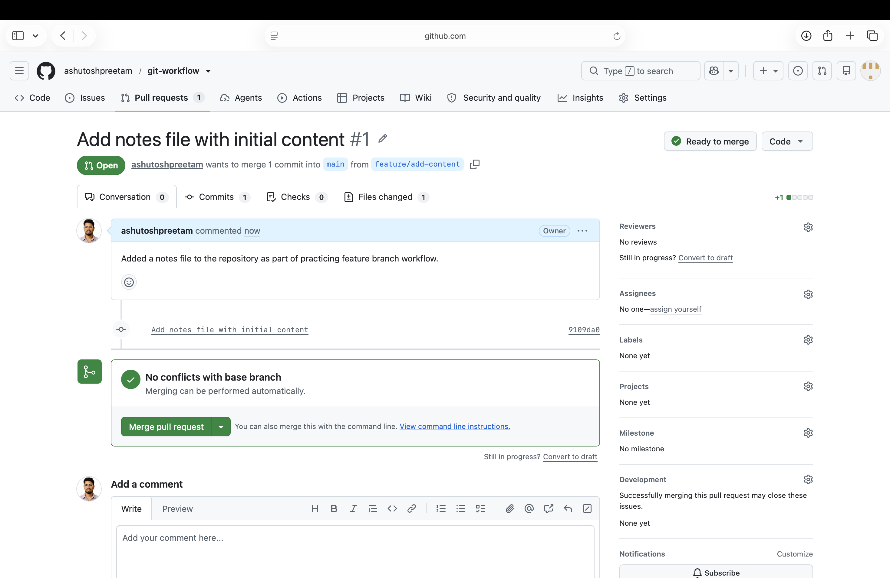
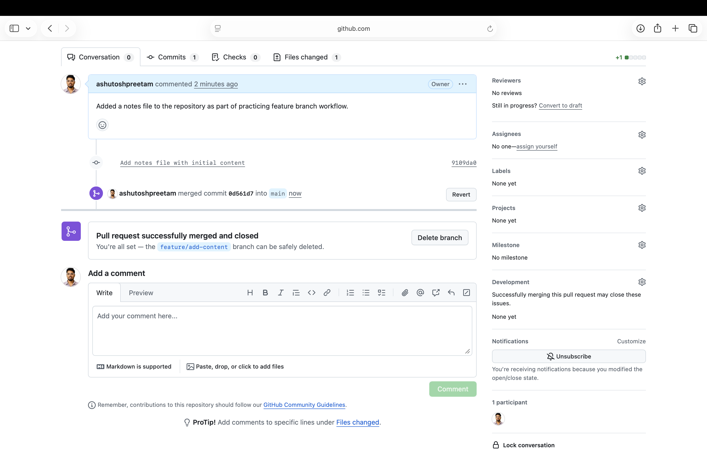
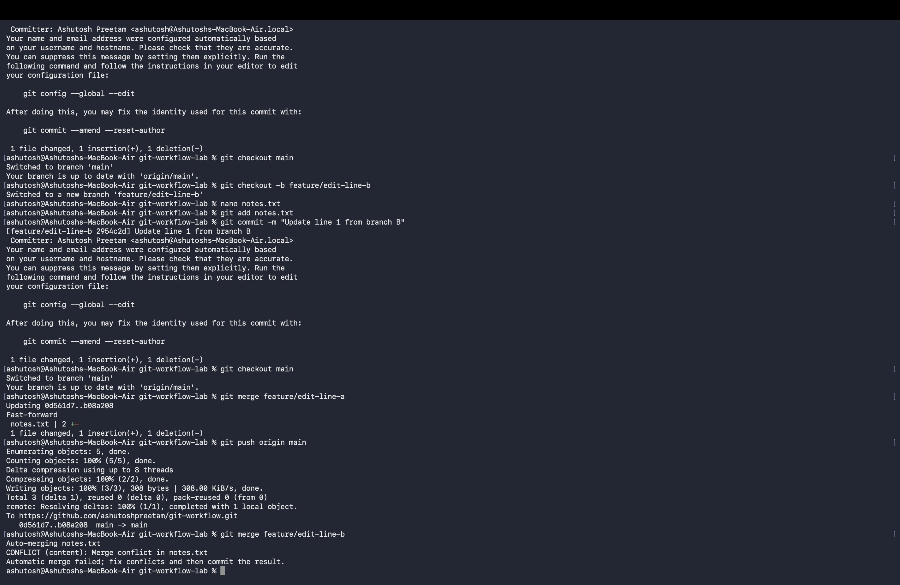
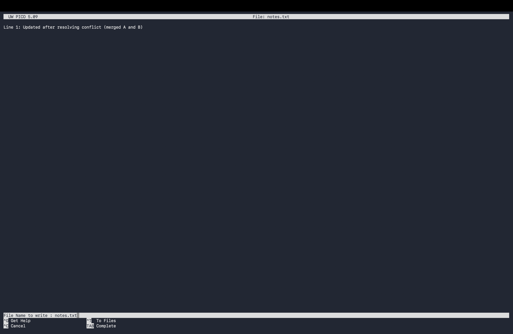
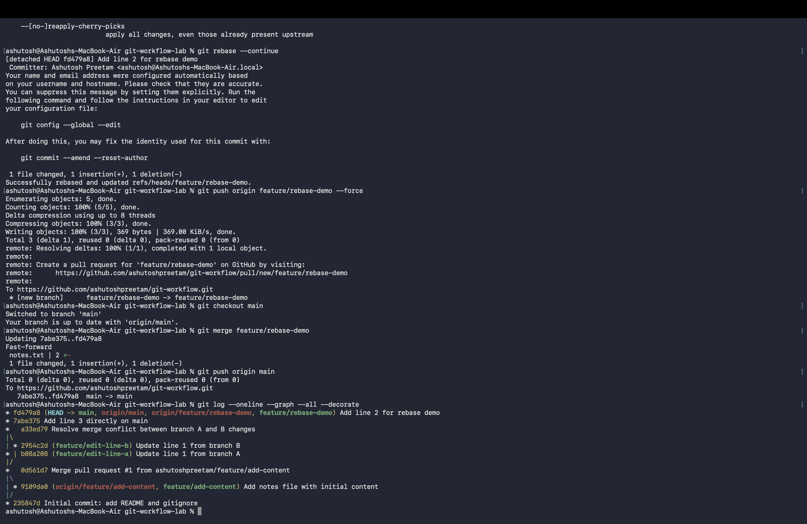

# Git Workflow Lab

A hands-on lab demonstrating core Git workflow: branching, merge conflicts, PR-style workflow, rebase, and clean commit discipline.

## What This Project Demonstrates
- Local repo initialization (git init)
- Feature branching and PR-style merging
- Real merge conflict creation and resolution
- Rebase workflow
- Clean, meaningful commit history
- .gitignore usage

## Commands Practiced
git init, clone, add, commit, branch, checkout/switch, merge, rebase, log, status, push, pull

## Command Transcript

git init
git add .gitignore README.md
git commit -m "Initial commit: add README and gitignore"
git remote add origin https://github.com/ashutoshpreetam/git-workflow-lab.git
git push -u origin main

git checkout -b feature/add-content
git add notes.txt
git commit -m "Add notes file with initial content"
git push -u origin feature/add-content

git checkout -b feature/edit-line-a
git commit -m "Update line 1 from branch A"

git checkout -b feature/edit-line-b
git commit -m "Update line 1 from branch B"

git merge feature/edit-line-a
git merge feature/edit-line-b   # conflict occurred here
git commit -m "Resolve merge conflict between branch A and B changes"

git checkout -b feature/rebase-demo
git rebase main
git push origin feature/rebase-demo --force

git checkout main
git merge feature/rebase-demo
git push origin main

git log --oneline --graph --all --decorate

## Screenshots

### Pull Request Created

### PR Merged

### Merge Conflict (before resolving)

### Merge Conflict Resolved

### Branch Graph

## Author
Ashutosh Preetam
